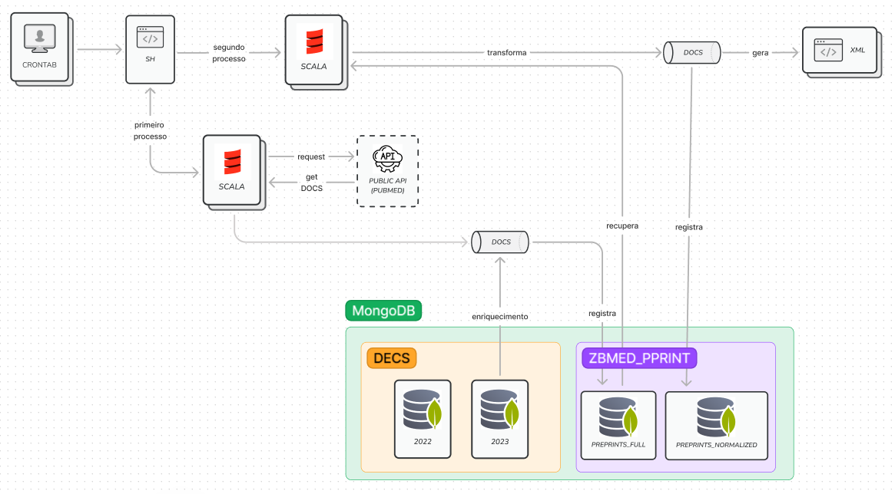

# ZBMedPrePrints-processing

This project retrieves documents through an API provided by ZBMED, stores them in MongoDB, performs transformations on the documents, inserts them into a new MongoDB collection, and ultimately generates an XML file.

### App versions
* Scala 2.13.12
* Sbt 1.8.0
* MongoDB 4.11.0

### Parametrizations

1. Clone repository
2. Files that require parameterization:

```
.
├── bin
| ├── run_process.sh
├── log.properties
.
```

### Execution

Navigate to the 'bin' directory with permissions and run the 'run_process.sh' script:

        .../bin $ ./run_process.sh

### Architecture Diagram - ZBMed

